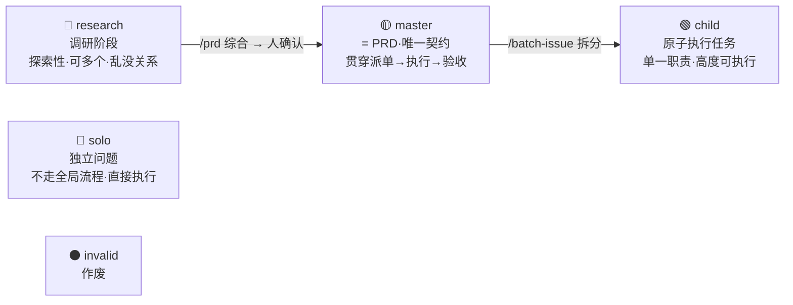
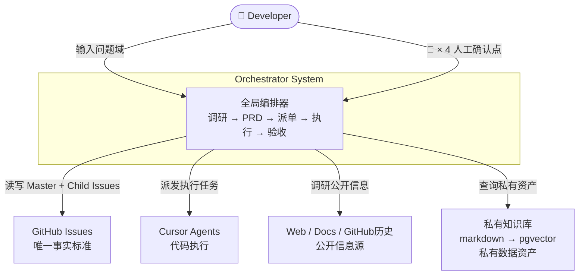
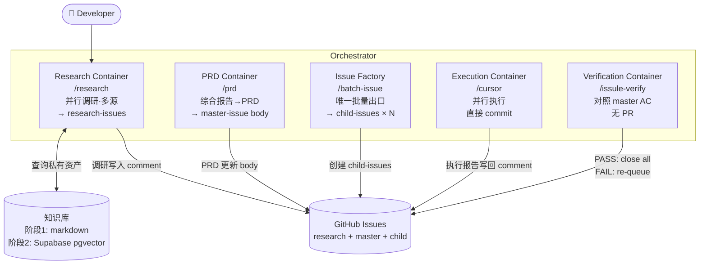
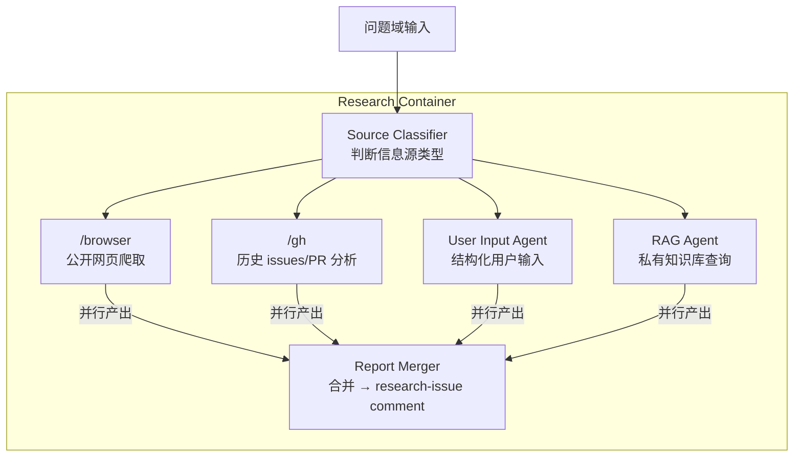
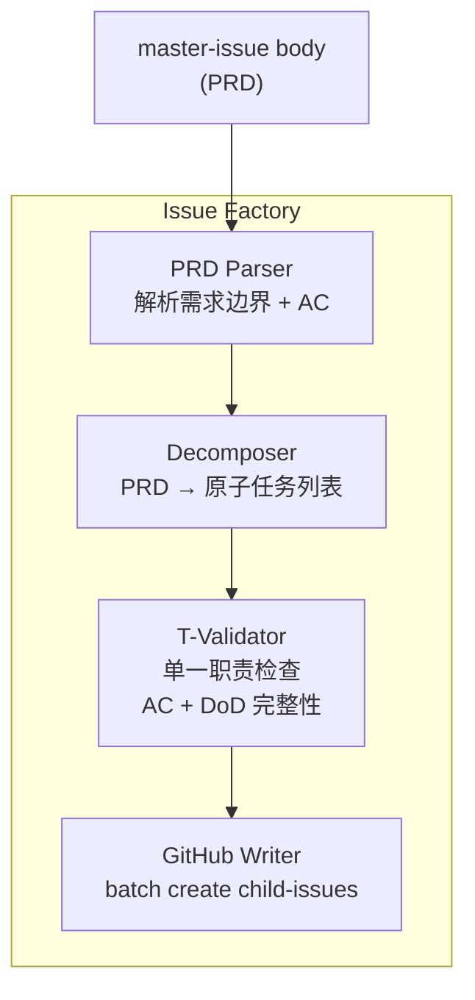
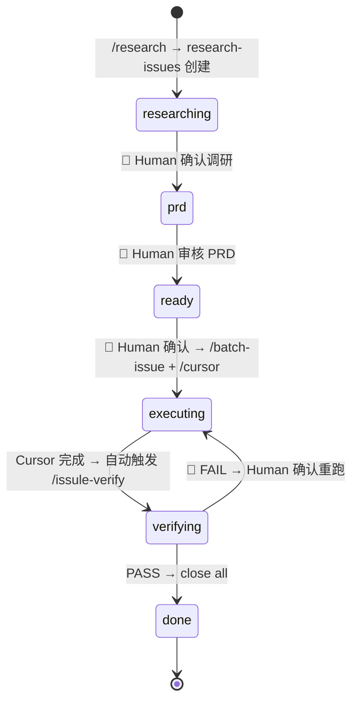
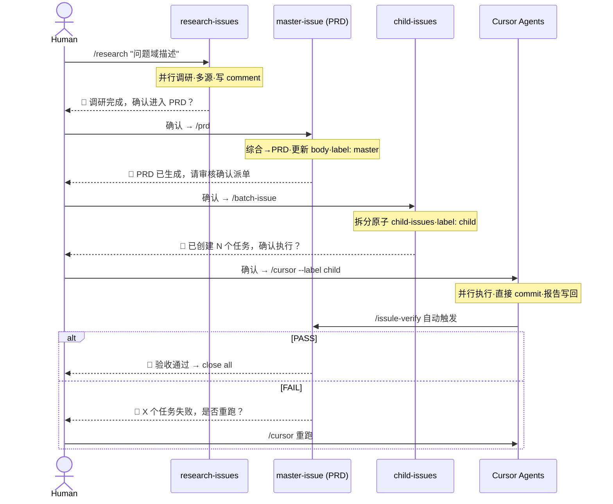
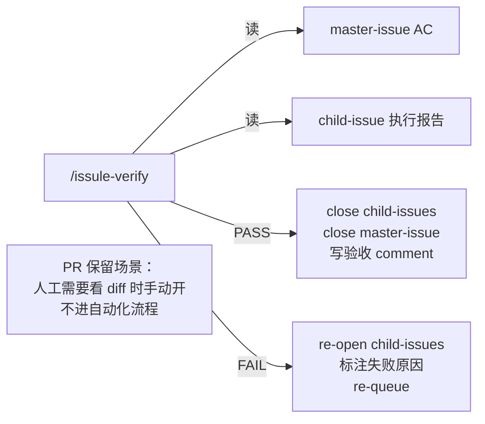
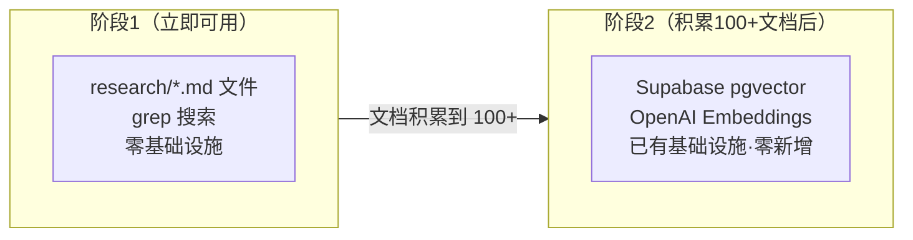

# Agent Orchestrator 架构图集

> 全局 Agent 编排系统设计，基于 GitHub Issue 作为唯一契约，分治法 + 总分总结构。

---

## 1. Issue 类型体系

| Label | 阶段 | 数量 | 特征 |
|-------|------|------|------|
| `research` | 调研 | M个 | 探索·混乱·可并行·可废弃 |
| `master` | PRD→验收 | 1个 | 权威·干净·贯穿始终 |
| `child` | 执行 | N个 | 原子·单一职责·可独立执行 |
| `solo` | 任意 | 1个 | 独立·不走 Orchestrator |
| `invalid` | 任意 | - | 作废标记 |

---

## 2. 全局 Orchestrator — C4 L1 系统上下文

---

## 3. 全局 Orchestrator — C4 L2 容器

---

## 4. C4 L3 — Research Container

---

## 5. C4 L3 — Issue Factory

---

## 6. Master Issue 状态机

> 🔔 = 必须人工确认，记录在 master-issue comment

---

## 7. 人机交互流（4个确认点）

---

## 8. 验收层（无 PR）

---

## 9. 私有知识库演进策略

---

## 10. Skill 地图

| Skill | 状态 | 输入 | 输出 |
|-------|------|------|------|
| `/research` | ❌ 待建 | 问题域描述 | research-issues + 调研 comment |
| `/prd` | ❌ 待建 | research-issue(s) | master-issue body = PRD |
| `/batch-issue` | ❌ 待建 | master-issue #N | child-issues × M |
| `/issue` | 🔧 重构自 issule-goal | master-issue 上下文 | 单个 child-issue，AC+DoD |
| `/cursor` | ✅ 扩展 | `--label child` | 直接 commit + 报告写回 |
| `/issule-verify` | ✅ 扩展 | master AC + child 报告 | close all / re-queue |
| `/browser` | ✅ 复用 | URL | 页面内容（/research 内部） |
| `/gh` | ✅ 复用 | - | issue 全程读写 |

**待建优先级：** P1 `/batch-issue` → P2 `/prd` → P3 `/research` → P4 `/issue` 重构

---

## 架构决策记录

| # | 决策 | 结论 |
|---|------|------|
| D1 | 调研信息源 | /browser + /gh历史 + 用户输入 + 私有RAG |
| D2 | 调研到PRD过渡 | research-issue 独立类型，/prd 产出干净 master-issue |
| D3 | 单一契约 | master-issue = PRD，body+comments 贯穿始终 |
| D4 | 批量边界 | 只有 /batch-issue 派生 child-issues |
| D5 | child-issue 核心 | AC + DoD（替代 T1/T2/T3） |
| D6 | 验收机制 | /issule-verify skill，无 PR，直接 close |
| D7 | 知识库 | 阶段1 markdown，阶段2 Supabase pgvector |
| D8 | 人机确认点 | 4个强制 🔔，全记录在 master-issue comment |
| D9 | skill 命名 | /prd·/issue·/batch-issue，无系统冲突 |
